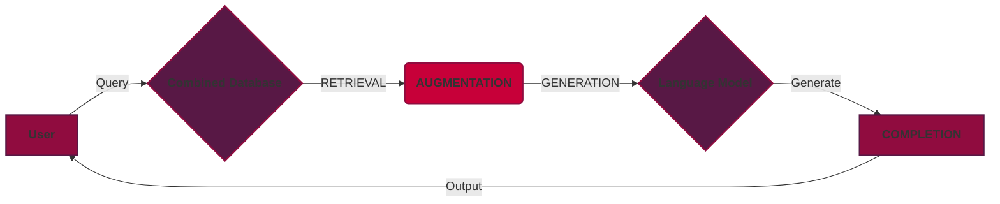

[**hammad python**](https://github.com/hsaeed3/hammadpy)

# *'One Script/Class'* Document AI (RAG) w/ hammadml

*The hammadml docAI pipeline is built using incredibly well designed python packages*<br>
**Annoy** | [Approximate Nearest Neighbors in C++/Python](https://github.com/spotify/annoy)<br>
**Instructor** | [Structured Outputs for LLMs](https://github.com/jxnl/instructor)<br>
**Sentence-Transformers** | [Multilingual Sentence & Image Embeddings with BERT](https://github.com/UKPLab/sentence-transformers)<br>
**spaCy** | [Industrial-strength Natural Language Processing (NLP) in Python](https://github.com/explosion/spaCy)<br>
**Whoosh** | [Pure-Python Full-Text Search Library](https://github.com/mchaput/whoosh)<br>

<br>

*This example also incorporates the COSTAR prompting framework*<br>
**COSTAR** | [COSTAR: Improved Temporal Counterfactual Estimation with Self-Supervised Learning](https://arxiv.org/abs/2311.00886)
___

**Document AI** is an implementation of **RAG (*Retrieval Augmented Generation*)**. You can view the paper for RAG here: [Retrieval-Augmented Generation for Knowledge-Intensive NLP Tasks](https://arxiv.org/abs/2005.11401)

This guide provides a quick overview & tutorial, using hammadml to create a fast Document AI pipeline. This pipeline is not meant for production/enterprise use, but rather for rapid development and prototyping. It is also very much in early access/beta, so there are a few funky issues here & there that need to be addressed.

This tutorial is best followed using the provided example script and documents. Run the following cell for a quick start, if you havent cloned the repository. 

```bash
git clone https://github.com/hsaeed3/hammadpy/
cd hammadpy/tutorials/documentai/
```

```zsh
pip install hammadml>=0.1.10 --upgrade
# The library will handle & install all dependencies on its own.
```

---

## Getting Started

The entire pipeline can be created using one python class; it primary goal is to open up more development doors, by 'dumbing down' the Retrieval Augmented Generation model to just a few functions. Once youve installed the library above, run the following code in your first cell block to import the necessary modules. **NOTE: The first run/cycle of this code block may take a second to complete, as the VectorDatabase and CrossEncoder require spaCy and Sentence-Transformer models.**



___

### Example Code:

*I absolutely do not recommend running this script multiple times, as it generates a new vector index each time. However, give it a shot.*
```python
from hammadml.data import Database, VectorDatabase
from hammadml.text import CrossEncoder
from hammadml.llms import Instructor 
# OR from hammadml.llms import Anthropic

# UNCOMMENT IF YOU GET "Can't find model 'en_core_web_sm'..."
# from spacy.cli import download
# download("en_core_web_sm")

# Building Databases (Uses Example Documents from /tutorials/docs)
db = Database()
db.load_docs(dir="docs") # Generates a new database
vectordb = VectorDatabase()
vectordb.create_from_database("databases/db")

# PreProcessing Query (Retrieval)
query = "Who is tow mater?"
encoder = CrossEncoder()
db_results = db.search(query=query)
vectordb_results = vectordb.search(query=query)
ranked_results = encoder.rank(query=query, x=db_results, y=vectordb_results)

# Preparing LLM (Augmentation)
system_prompt = f"""# CONTEXT
You are a master of speaking organically and naturally. You have just searched your memory, and returned this
relevant information to use: This information is based on the user's query and the retrieved information, You will never
use this information as a first person, or as a direct quote. You will always paraphrase and use your own style to convey
the message.
<BEGIN CONTEXT>
{[sentence for sentence in ranked_results]}
<END CONTEXT>

# OBJECTIVE
Using the retrieved information defined above, you will answer the user's query in an incredibly skillfull manner.
You can paraphrase, quote, etc. as long as the information is relevant and accurate. Do not just directly copy and paste,
the information. You must use your own words and style to convey the information. Your response style must be friendly;
first iterating that you have found the information, and then providing an answer to the user's query; that implements the 
retrieved information, in a skillfull manner.
"""

# Query LLM (Generation)
llm = Instructor() # If key is blank, the OPENAI_API_KEY environment variable will be used.
# You can use llm = Instructor(api_key="YOUR_API_KEY") as well
completion = llm.instruct(system=system_prompt, query=query, model="4")
print("")
print("Database Results:")
print(db_results)
print("")
print("Vector Database Results:")
print(vectordb_results)
print("")
print("Cross Encoder Results:")
print(ranked_results)
print("")
print("LLM Completion:")
print(completion)
```

___

## Creating The Databases

The provided ```tutorials/documentai``` folder contains 4 sample movie scripts we'll use in this tutorial. The next code block utilizes the parsing functionality built into the Database class, which will automatically read through a directory, pick up all documents (.txt,.pdf), and properly import them into a new/existing ```Whoosh``` database. The following code uses the repository's provided example document directory to build a new database. You'll notice that a new /databases/db folder has been created, this will store the database. <br>
Creating a database through this function will ensure the following.
1. Documents will be assigned ID's
2. Documents will be individually parsed
3. Each document will recieve an 'id', 'text', & 'content' header in the database.

```python
from hammadml.data import Database
```

```python
database = Database()

database.load_docs(dir='docs')
```

```python
# An example of searching the database.

results = database.search(query="Barry Benson")
for result in results:
  print(result)
```
<br>

*Output:*

>Scripts.com
>Bee Movie
>By Jerry Seinfeld
>
>NARRATOR:
>(Black screen with text; The sound of buzzing bees can be heard)
>According to all known laws
>of aviation,
> :
>there is no way a bee
>should be able to fly....

Uh oh. It seems the database search returned the entire document itself, for now the ```Database``` class does not handle NLP on its own; but the next section covers the automatic NLP pipeline incorporated by the ```VectorDatabase```

<br>

___

### Creating The Vector Database

The ```VectorDatabase``` class comes prebuilt with functions to create a searchable vector index using a created ```Database```, as well as from sentences/text. Currently it does not provide document parsing on its own, that must be done using the ```Database``` class. <br>
Creating a vector database using this class will ensure the following steps.
1. Documents will be chunked/tokenized.
2. Chunks will be Vectorized
3. Chunks & Vectors will be added as headers to the Database.

```python
from hammadml.data import VectorDatabase
```

```python
vectordb = VectorDatabase()
vectordb.create_from_database("databases/db") # The database path created by the earlier code blocks.
```

The ```.search()``` functionality in the ```VectorDatabase``` is properly structured for vector search, and vectorizes the query through SentenceTransformers before performing ANN (Approximate Nearest Neighbors) search.

```python
results = vectordb.search(query="Tow Mater")

for result in results:
  print(result)
```

<br>

*Output:*

>(883, 'Mater!', '24007732-13ea-41d1-83bf-5cbdac81ff04', [0.01754646562039852,...
>(1052, 'Mater!\nMater!', '24007732-13ea-41d1-83bf-5cbdac81ff04', [0.01701790653169155,...
>(1051, 'Look out!\nMater?', '24007732-13ea-41d1-83bf-5cbdac81ff04', [0.024842681363224983,...
>(833, 'Mater, I got dibs, next turn!', '24007732-13ea-41d1-83bf-5cbdac81ff04', [-0.061736349016427994, -0.09940000623464584,...
>(1627, "Mater didn't get to say goodbye.", '24007732-13ea-41d1-83bf-5cbdac81ff04', [0.109908826649189, >-0.027151046320796013, 0.1038813591003418, 0.01063409261405468, 0.04608910158276558,


As you may be able to tell, line breaks are not properly stripped from the text. Well boo-hoo, do something yourself. Just kidding, modular text NLP processing for individual docs/chunks straight inside both the ```Database``` & ```VectorDatabase```; including **Customizable long document cleaning & Greater control during the chunking period of the VectorDatabase. 

___

## Document AI (Retrieval Augmented Generation)

Now that we have both our database and vector database results, we can rank them against the query. The ```CrossEncoder``` uses ```sentence-transformers``` to create a re-ranker.

```python
from hammadml.text import CrossEncoder
```

```python
encoder = CrossEncoder()
query = "Who is tow mater?"
```

```python
db_results = database.search(query=query)
vectordb_results = vectordb.search(query=query)
ranked_results = encoder.rank(query=query, x=db_results, y=vectordb_results)
```

___

### Query LLM

We're finally ready to generate the LLM's completion based on our results; the following cell block demonstrates a cut up example of the COSTAR prompting framework.
```python
system_prompt = f"""
# CONTEXT
You are a master of speaking organically and naturally. You have just searched your memory, and returned this
relevant information to use: This information is based on the user's query and the retrieved information, You will never
use this information as a first person, or as a direct quote. You will always paraphrase and use your own style to convey
the message.
<BEGIN CONTEXT>
{[sentence for sentence in ranked_results]}
<END CONTEXT>

# OBJECTIVE
Using the retrieved information defined above, you will answer the user's query in an incredibly skillfull manner.
You can paraphrase, quote, etc. as long as the information is relevant and accurate. Do not just directly copy and paste,
the information. You must use your own words and style to convey the information. Your response style must be friendly;
first iterating that you have found the information, and then providing an answer to the user's query; that implements the 
retrieved information, in a skillfull manner.
"""
```

<br>

Now that the system prompt has been built; the completion can be generated. Currently the library offers support for using OpenAI (w/ Instructor) & Anthropic (Claude) API models. The cell block below utilizses ```gpt-4-preview-1106``` from the OpenAI API.

```python
from hammadml.llms import Instructor   # or 'Anthropic'
```

```python
llm = Instructor() # If key is blank, the OPENAI_API_KEY environment variable will be used.
# You can use llm = Instructor(api_key="YOUR_API_KEY") as well

completion = llm.instruct(system=system_prompt, query=query, model="4")
print(completion)
```

> completion='In the world of Pixar\'s Cars, Tow Mater, often simply referred to as Mater, is a character that attendees and fans of the series have grown to love. He\'s not just any tow truck; Mater stands out with his rusty, dented exterior, which adds to his charm and down-to-earth personality. Despite his appearance, he\'s extremely kind-hearted, always willing to lend a hook to those in need. He hails from the small town of Radiator Springs and is best friends with the series\' protagonist, Lightning McQueen. Mater\'s adventures are not just limited to towing; he also finds himself embroiled in international espionage in "Cars 2," showcasing his versatility and depth as a character. His Southern drawl and catchphrases like \'Dad-gum!\' and \'Git-R-Done!\' have endeared him to audiences around the globe.'
